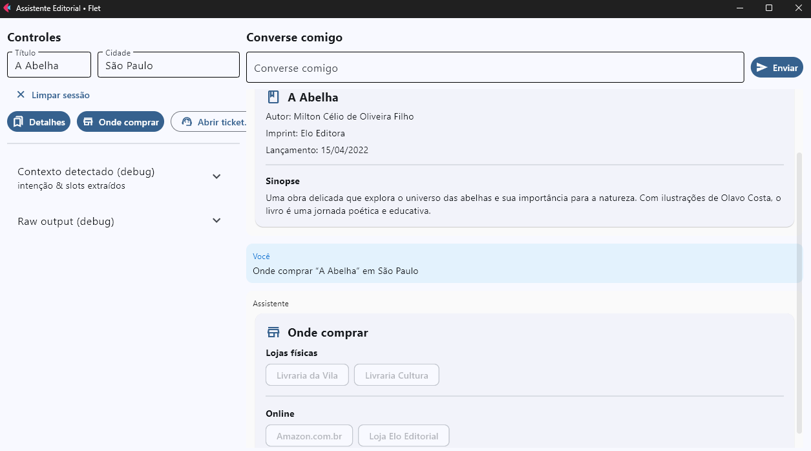

# Desafio Grupo Elo Editorial: Assistente Editorial Multiagente com CrewAI + Gemini

Este projeto implementa um **assistente editorial** conforme os requisitos do desafio:

- **LLM Gemini** (usando `GEMINI_API_KEY`)
- **CrewAI** para orquestração de intenções e tarefas
- **Interfaces**: CLI e UI (Flet)
- **Logs básicos** (intenção, ferramentas chamadas, erros)
- **Segurança**: chave em `.env`, nunca no código
- **Arquitetura**: clara, modular, código limpo

## 💡Tecnologias Utilizadas
- Python 3.11+
- CrewAI
- CrewAI Tools
- Gemini API (Google AI)
- Flet
- python-dotenv
- pip/venv

## 🚀 Instalação

#### 1. Clonar o repositório
```bash
git clone https://github.com/criswagmaker/Desafio-Elo-Editorial.git
cd Desafio-Elo-Editorial
```

#### 2. Criar ambiente virtual
```bash
python -m venv .venv
source .venv/bin/activate     # Linux/Mac
.venv\Scripts\activate        # Windows
```
#### 3. Instalar dependências
```bash
pip install -r requirements.txt
```

## ⚙️ Configuração
Crie um arquivo .env na raiz do projeto com

```bash
# Chave da API Gemini (obtenha em https://aistudio.google.com/)
GEMINI_API_KEY=COLOQUE_SUA_CHAVE_AQUI

# Modelo Gemini a ser usado
# Exemplos: gemini-1.5-flash | gemini-1.5-pro
GEMINI_MODEL=COLOQUE_SEU_MODELO_AQUI
```

Um arquivo .env.example já está incluído no projeto como modelo.
Basta copiá-lo e preencher sua chave e modelo:

```bash
cp .env.example .env   # Linux/Mac
copy .env.example .env # Windows PowerShell
```

## 📚 Catálogo de livros

O catálogo usado para consulta é um arquivo data/catalog.json.
Exemplo de estrutura:
```json
{
  "books": [
    {
      "title": "A Abelha",
      "author": "Milton Célio de Oliveira Filho",
      "imprint": "Elo Editora",
      "release_date": "15/04/2022",
      "synopsis": "Uma obra delicada que explora o universo das abelhas e sua importância para a natureza.",
      "availability": {
        "São Paulo": ["Livraria da Vila", "Livraria Cultura"],
        "Rio de Janeiro": ["Livraria Travessa"],
        "Online": ["Amazon.com.br", "Loja Elo Editorial"]
      }
    }
  ]
}
```

## ▶️ Como rodar
#### 1. CLI

```bash
python app.py
```

```bash
Quero saber sobre "A Abelha"
Onde compro A Abelha em São Paulo?
Abrir um ticket 'Dúvida sobre submissão'
```

#### 2. UI (Flet)

```bash
python -m ui.app
```
Na interface você pode:

- Usar o campo Converse comigo para perguntas livres
- Clicar em Detalhes, Onde comprar, Abrir ticket para usar consulta por botão (preencher os campos Título e Cidade)
- Preencher e enviar tickets de suporte
- Limpar a sessão

## 🧪 Exemplos de Fluxo
Cenário A
```bash
Usuário: Quero saber sobre "A Abelha"
Bot: (detalhes do livro + sinopse)
Usuário: Em São Paulo?
Bot: (lojas físicas em SP + opções online)
```
Cenário B
```bash
Usuário: Onde compro "A Abelha"?
Bot: (mostra opções de compra)
```
Cenário C
```bash
Usuário: Abra um ticket 'Dúvida sobre submissão'
Bot: (abre formulário de ticket, usuário preenche e envia)
Bot: Ticket aberto! ID: TCK-XXXXXX; status: open.
```

## Exemplo da UI

